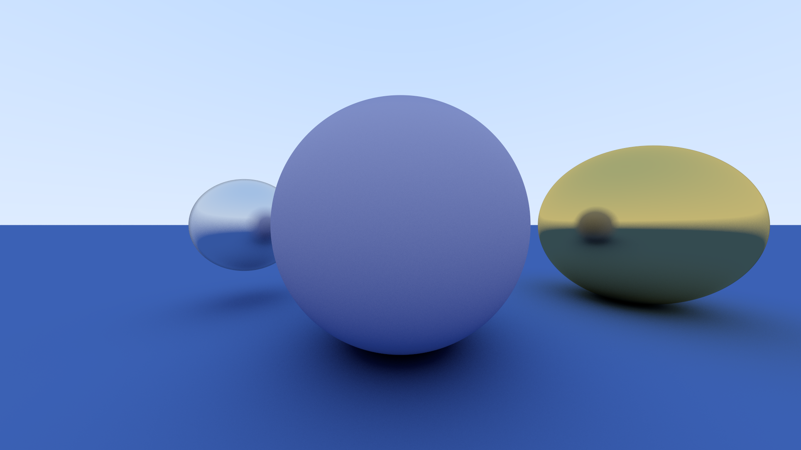
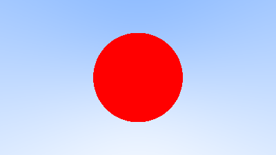
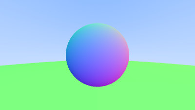
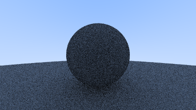
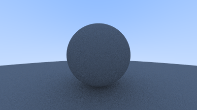
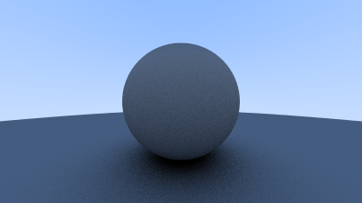

## Ray Tracer

A simple Rust ray tracer from scratch that renders spheres and planes in different materials.

### Build Steps (very brief)

- Made vec3 and camera to shoot rays through each pixel.

- Visualized surface normals as RGB for a gradient sphere.

- Added point-sampled antialiasing.

- Implemented diffuse shading, then fixed shadow acne.

- True Lambertian materials.

- Metals and planes for the final scene.

